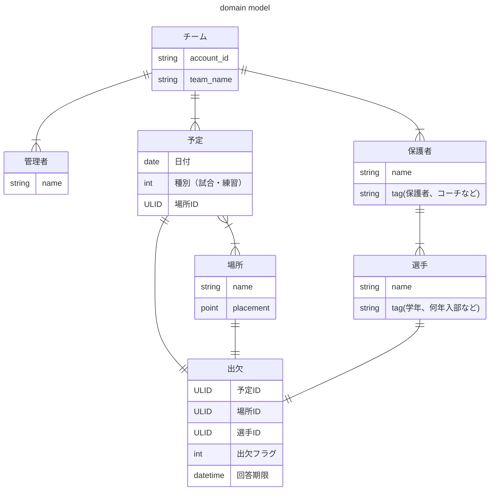

# ドメインモデル図・オブジェクト図

## ドメインモデル図

```mermaid
---
title: domain model
---
erDiagram
    チーム ||--|{ 管理者 : ""
    チーム ||--|{ 保護者 : ""
    チーム ||--|{ 予定 : ""
    保護者 ||--|{ 選手 : ""
    チーム {
        string account_id
        string team_name
    }
    管理者 {
        string name
    }
    保護者 {
        string name
        string tag(保護者、コーチなど)
    }
    選手 {
        string name
        string tag(学年、何年入部など)
    }
    予定 {
        date 日付
        int 種別（試合・練習）
        ULID 場所ID
    }
    場所 {
        string name
        point placement
    }
    予定 }|--|{ 場所 : ""
    予定 ||--|| 出欠 : ""
    場所 ||--|| 出欠 : ""
    選手 ||--|| 出欠 : ""

    出欠 {
        ULID 予定ID
        ULID 場所ID
        ULID 選手ID
        int 出欠フラグ
        datetime 回答期限
    }
```

## オブジェクト図