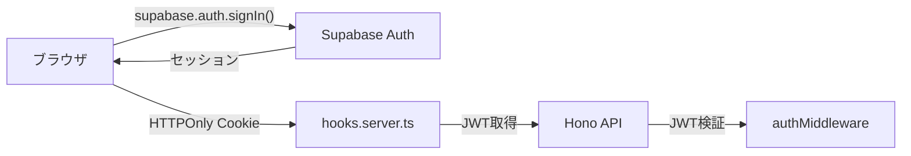

# Kanaria プロジェクト ナレッジベース

このドキュメントは、過去の開発経験から抽出した重要な知識、ベストプラクティス、解決手法をまとめたものです。

---

## 🔐 認証（Authentication）

### JWT署名とSupabase認証の仕組み

#### 問題: JWT署名検証エラーの発生経緯

- **症状**: `JwtTokenSignatureMismatched` または `JOSENotSupported: Unsupported "alg" value` エラー
- **原因**: Supabaseが対称鍵(HMAC)から非対称鍵(ES256/RS256)に移行したため
- **学習**: SupabaseのJWT検証は、サービスロール鍵ではなく、公開鍵（JWKS経由）を使用する必要がある

#### 解決策: 非対称鍵によるJWT検証

```typescript
// ❌ 古い方法 (HMAC)
const payload = await verify(token, SUPABASE_JWT_SECRET);

// ✅ 新しい方法 (JWKS + ES256/RS256)
import { createRemoteJWKSet, jwtVerify } from 'jose';

const JWKS = createRemoteJWKSet(
  new URL(`https://<project-ref>.supabase.co/auth/v1/jwks`)
);

const { payload } = await jwtVerify(token, JWKS, {
  issuer: `https://<project-ref>.supabase.co/auth/v1`,
  audience: 'authenticated'
});
```

#### ローカル開発環境での認証

- **ローカルSupabase**: `nix develop`でSupabaseローカル環境を起動
- **メール認証テスト**: Supabase Inbucketでメールをキャプチャできる
  - URL: `http://localhost:54324` (通常のInbucketポート)
  - サインアップメール確認、パスワードリセットなどのフローをテスト可能

### 認証フロー設計

#### Cookie vs Authorization Header

**採用方式**: HTTPOnly Cookie（フロントエンド） + Authorization Bearer（バックエンド）



**理由**:
- **フロント**: Cookieで自動送信、XSS対策
- **バック**: Authorizationヘッダーで標準的なAPI認証

### 認証ミドルウェアの型安全性

#### 問題: `email: string | undefined` の型エラー

```typescript
// ❌ エラー: payloadのemailがundefinedの可能性
c.set("user", {
  id: payload.sub,
  email: payload.email // Type error: string | undefined
});

// ✅ 解決: emailのバリデーション
if (!payload.email) {
  return c.json({ error: "Invalid token: missing email" }, 401);
}
c.set("user", {
  id: payload.sub!,
  email: payload.email
});
```

---

## 🗄️ データベース（Database & ORM）

### Drizzle ORMパターン

#### リポジトリパターンの実装

```typescript
export class PlayerRepository {
  constructor(private db: DrizzleDb) {}

  async findByParentUserId(parentUserId: string): Promise<Player[]> {
    return this.db
      .select()
      .from(players)
      .where(eq(players.parentUserId, parentUserId));
  }
}
```

#### 関連データの取得

**単一ラベル設計への移行**（labelablesテーブル廃止）

- **旧設計**: 多対多（`tags ↔ labelables ↔ labels`）
- **新設計**: 1対多（`tags.labelId → labels`）

```typescript
// ✅ 単一ラベル取得
async findById(id: string) {
  const [tag] = await this.db
    .select({
      tag: tags,
      label: labels
    })
    .from(tags)
    .leftJoin(labels, eq(tags.labelId, labels.id))
    .where(eq(tags.id, id));
  
  return tag ? { ...tag.tag, label: tag.label } : null;
}
```

#### マイグレーション戦略

- **学年タグの作成**: マイグレーションで自動生成（`INSERT INTO tags ...`）
- **失敗時の確認**: テストが失敗したら、マイグレーションが実行されているか確認
- **RLS (Row Level Security)**: Supabaseで必ず有効化し、テストデータもRLSルールに準拠させる

---

## 🧪 テスト（Testing）

### テスト戦略（ハイブリッドアプローチ）

| テストレイヤー | データベース | Supabase Auth | 目的 |
|---------------|-------------|---------------|------|
| **Repository** | ✅ 本物 | ⚠️ モック | SQL制約、RLS、データ正確性 |
| **Route** | ⚠️ モック | ⚠️ モック | HTTP応答、バリデーション、認証チェック |

詳細は [`packages/backend/TESTING.md`](file:///home/jakelizzi/work/kanaria/packages/backend/TESTING.md) を参照。

### よくある失敗パターン

#### 1. テスト内でのデータ不足

```typescript
// ❌ 学年タグが存在しない
const gradeTags = await repo.findGradeTags();
expect(gradeTags).toHaveLength(6); // Fails!

// ✅ マイグレーションで学年タグを作成する
-- migrations/XXX-create-grade-tags.sql
INSERT INTO tags (id, team_id, name, label_id) VALUES
  ('grade-1', 'team-123', '1年生', 'label-grade'),
  ...
```

#### 2. リポジトリテストでのモック禁止

```typescript
// ❌ リポジトリテストでDB接続をモックしない
vi.mock("drizzle-orm");

// ✅ useTestDb()を使用
import { useTestDb } from "../../test-helper.js";

describe("PlayerRepository", () => {
  const getDb = useTestDb();
  
  it("should find players", async () => {
    const repo = new PlayerRepository(getDb());
    // ...
  });
});
```

#### 3. RouteテストでのDB接続禁止

```typescript
// ❌ RouteテストでDBに接続しない
const db = await getTestDb();

// ✅ リポジトリをモック
vi.mock("../../db/repositories/PlayerRepository.js", () => ({
  PlayerRepository: class {
    find = vi.fn().mockResolvedValue([]);
  }
}));
```

---

## 🎨 フロントエンド（SvelteKit）

### Svelte 5のルール

#### `{@const}` タグの配置制約

```svelte
<!-- ❌ トップレベルに直接配置できない -->
{@const foo = bar}
<div>{foo}</div>

<!-- ✅ {#if}, {#each}, コンポーネントタグの直下に配置 -->
{#each items as item}
  {@const formattedName = item.name.toUpperCase()}
  <div>{formattedName}</div>
{/each}
```

### Form Actionsへの移行

**方針**: データ変更操作は、クライアントサイドAPIコールからSvelteKitのForm Actionsへ移行

#### Before (API Call)

```typescript
// ❌ クライアントサイドでfetch
async function createPlayer(data: PlayerInput) {
  await fetch('/api/players', {
    method: 'POST',
    body: JSON.stringify(data)
  });
}
```

#### After (Form Action)

```typescript
// ✅ +page.server.ts
export const actions = {
  create: async ({ request, locals }) => {
    const formData = await request.formData();
    // ...バリデーション、DB操作
  }
};
```

**メリット**:
- プログレッシブエンハンスメント
- 型安全性向上
- SEO/アクセシビリティ向上

### ルーティングとアクセス制御

#### `hooks.server.ts`でのリダイレクト

```typescript
// 認証状態に応じたリダイレクト
export const handle: Handle = async ({ event, resolve }) => {
  const session = await locals.getSession();
  
  if (!session && isProtectedRoute(event.url.pathname)) {
    throw redirect(303, '/login');
  }
  
  if (session && isAuthRoute(event.url.pathname)) {
    throw redirect(303, '/dashboard');
  }
  
  return resolve(event);
};
```

### GlobalHeaderの条件表示

```svelte
<!-- +layout.svelte -->
{#if $page.data.session && !isAuthRoute($page.url.pathname)}
  <GlobalHeader />
{/if}
```

---

## 🐛 トラブルシューティング

### よくあるエラーと解決策

#### 1. `500 Internal Server Error` during `/teams/activate`

**原因**: JWT検証失敗、または環境変数の設定ミス

**確認項目**:
1. `SUPABASE_URL` と `SUPABASE_ANON_KEY` が正しいか
2. JWKSのURLが正しいか（`/auth/v1/jwks`）
3. `issuer`と`audience`が正しいか

#### 2. Nix develop でシェルがbashになる

**症状**: `nix develop`実行後、zshではなくbashになる

**理由**: Nixは明示的にシェルを指定しない限り、デフォルトでbashを使用する

**解決案**:
- `flake.nix`で`shellHook`に`exec zsh`を追加
- または、Nixシェル内で手動で`zsh`を起動

#### 3. TypeScriptの"Unexpected any"エラー

**原因**: `vi.fn()`や型キャストでanyが推論される

**解決**:
```typescript
// ❌ anyが推論される
const mockFn = vi.fn();

// ✅ 明示的な型指定
const mockFn = vi.fn<() => Promise<Player[]>>();
```

---

## 📦 デプロイ・インフラ

### 現在のスタック

- **Frontend**: Cloudflare Pages
- **Backend**: Cloudflare Workers (Hono)
- **Database**: Supabase PostgreSQL
- **Storage**: Cloudflare R2 (予定)

### ローカル開発環境

```bash
# Nixシェルで全て管理
nix develop  # Postgres, Supabase, Node.js etc.

# または direnv
direnv allow

# バックエンドテスト
cd packages/backend
pnpm test

# フロントエンド起動
cd packages/frontend
pnpm dev
```

---

## 🎯 ベストプラクティス

### TDD手法の採用

- **Red-Green-Refactor**サイクルを厳守
- テスト→実装→リファクタリングの順で進める
- 参考: t_wadaのTDD思想

### デバッグログの削除

- 本番コードに`console.log`や`console.debug`を残さない
- PRマージ前に必ず削除
- 検索コマンド: `grep -r "console\\.log" packages/`

### セキュリティ

- APIキーは環境変数で管理
- `.env`ファイルは`.gitignore`に含める
- Supabase RLSを必ず有効化
- フロントエンドにサービスロール鍵を含めない

---

## 📚 参考リソース

- **Svelte公式（LLM向け）**: https://svelte.jp/docs/llms
- **Supabase公式ドキュメント**: 最新版を常に参照
- **プロジェクトアーキテクチャ**: [`/doc/architecture.md`](file:///home/jakelizzi/work/kanaria/doc/architecture.md)
- **テストガイド**: [`packages/backend/TESTING.md`](file:///home/jakelizzi/work/kanaria/packages/backend/TESTING.md)

---

## 🔄 メンテナンスポリシー

このドキュメントは以下の条件で更新する:

1. 会話内で繰り返し指示された内容がある場合
2. 新しい重要なパターンや問題解決が発見された場合
3. 冗長な箇所や圧縮の余地がある場合

**目標**: 簡潔でありながら密度の濃い、実用的なナレッジベース
