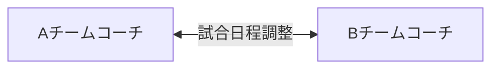
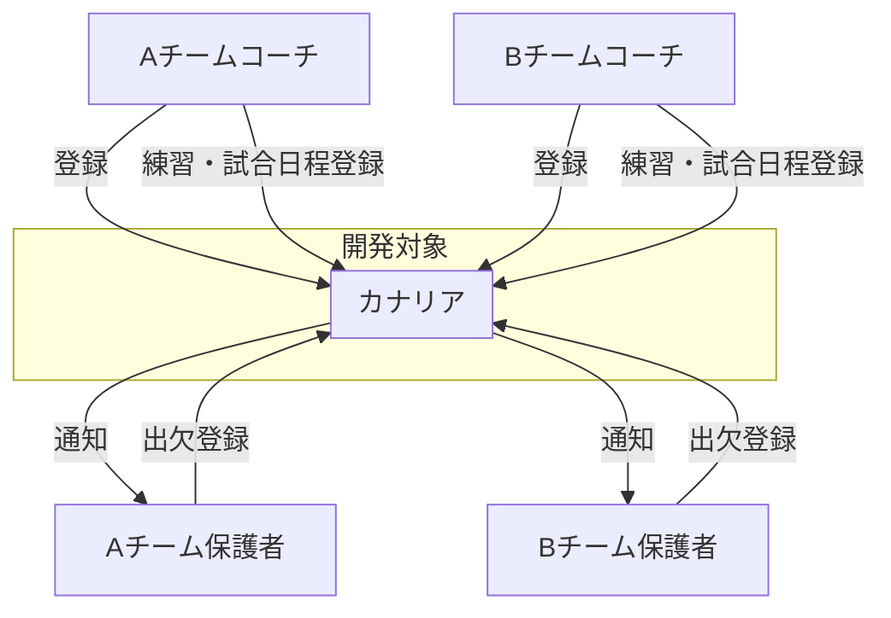
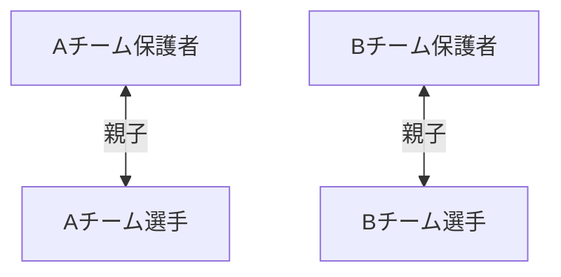
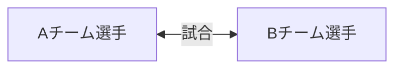

# システム関連図

以下は、地域サッカークラブ向けのグループ管理 SaaS を想定したシステム関連図（Mermaid）です。

```mermaid
graph LR
    CoachA["Aチームコーチ"] <--試合日程調整--> CoachB["Bチームコーチ"]
```

```mermaid
graph TD
	%% Actors
    CoachA["Aチームコーチ"]
    CoachB["Bチームコーチ"]
	ParentA["Aチーム保護者"]
    ParentB["Bチーム保護者"]

	subgraph 開発対象
        カナリア
	end

	subgraph カナリア
        カナリア
    end

    CoachA --登録--> カナリア 
    CoachA --練習・試合日程登録--> カナリア 
    CoachB --登録--> カナリア
    CoachB --練習・試合日程登録--> カナリア 
    ParentA --出欠登録--> カナリア
    ParentB --出欠登録--> カナリア
    カナリア --通知--> ParentA
    カナリア --通知--> ParentB
``` 

```mermaid
graph TD
    %% Actors
	ParentA["Aチーム保護者"]
    ParentB["Bチーム保護者"]
    ChildA[""Aチーム選手]
    ChildB[""Bチーム選手]

    ParentA <--親子--> ChildA
    ParentB <--親子--> ChildB
```

```mermaid
graph LR
    %% Actors
    ChildA[""Aチーム選手]
    ChildB[""Bチーム選手]

    ChildA <--試合--> ChildB
```

補足:

- コーチと保護者は同一人物の可能性もあります
- コーチ同士の試合日程調整はシステム外で行います
