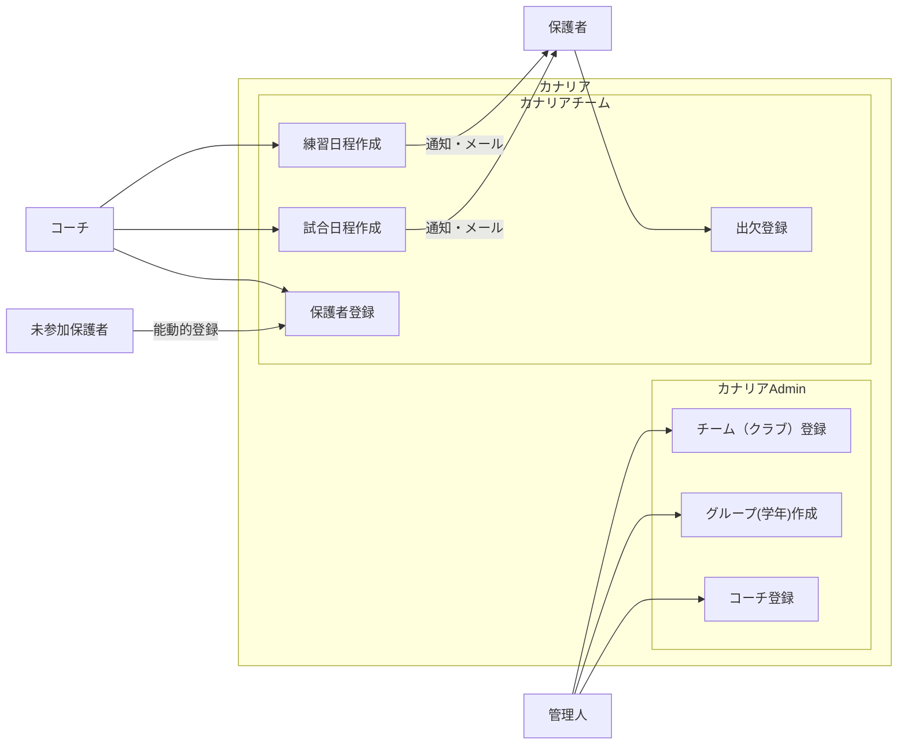

# ユーズケース図

以下は、地域サッカークラブ向けのグループ管理 SaaS を想定したユースケース図（Mermaid）です。

```mermaid
graph LR
	%% Actors
    Admin["管理人"]
	Parent["保護者"]
    ParentB["未参加保護者"]
	Coach["コーチ"]

	subgraph カナリアAdmin
		task1["チーム（クラブ）登録"]
		task2["グループ(学年)作成"]
		task3["コーチ登録"]
	end

    subgraph カナリアチーム
		task4["練習日程作成"]
        task5["試合日程作成"]
        task6["出欠登録"]
        task7["保護者登録"]
    end

	subgraph カナリア
        カナリアAdmin
        カナリアチーム
    end

    Admin --> task1
    Admin --> task2
    Admin --> task3
    Coach --> task4
    Coach --> task5
    Coach --> task7
    Parent --> task6
    ParentB --能動的登録--> task7
    task4 --通知・メール--> Parent
    task5 --通知・メール--> Parent
``` 

## 補足:

- 管理人＝コーチ＝保護者のエンティティは便宜上分けていますが、同一人物の可能性があります。
    - 現実世界では同一人物でもシステム内では別のアカウントとして扱うほうが良いかも